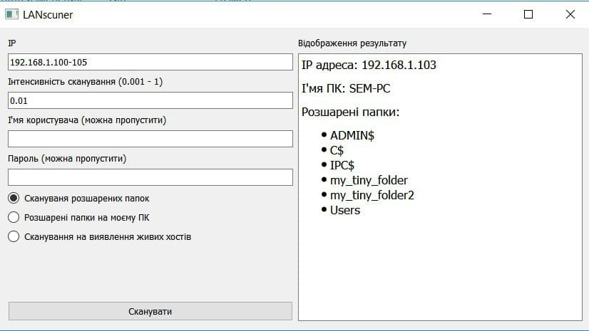

# Python Shared Folder Scanner

This is a utility that provides features to find shared folders and identify live hosts in the local network.



## Features
- scan the local network for the shared folder 
- search shared folder on your computer
- detect the alive hosts

## Usage
- Clone the repository

```
git clone https://github.com/vt-dotua/Python-Shared-Folder-Scanner.git
```

- Install virtualenv

```
virtualenv env
```

- Activate virtualenv

On Windows:

```
.\env\Scripts\activate
```

On macOS and Linux:

```
which python
.../env/bin/python
```
 - Install requirements.txt
 ```
 pip install -r requirements.txt
 ```